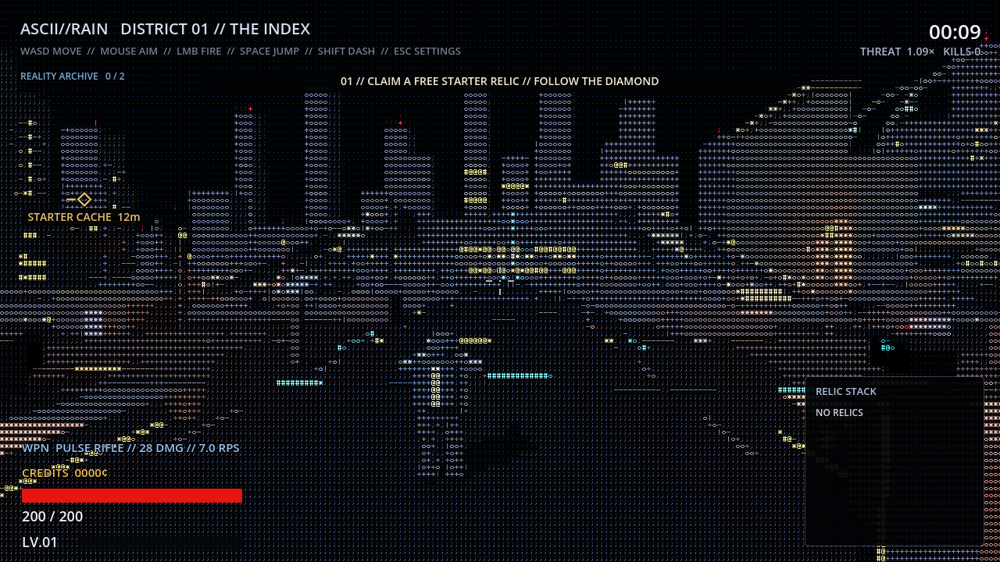
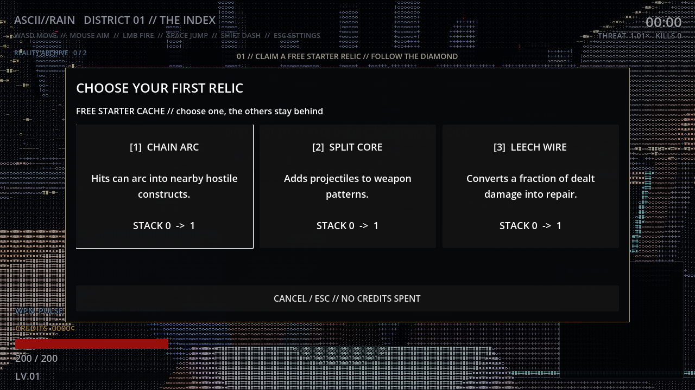

# ASCII//RAIN

**A Godot action game in alpha · v0.19.1-alpha**

ASCII//RAIN turns a code-built city into a place to explore, fight through, and make small tactical choices. It combines a custom ASCII world renderer with third-person movement, readable combat, a 3D player character, relic choices, and a persistent Reality Archive.

The visual rule is simple; making the city readable is the hard part. The player should be thinking about the next route, not squinting at the screen like it owes them money.

## A look inside

These are captures from the supplied v0.19.1 project, not mockups.

## What is in this version

- **Location 01: Threshold Market** — a ten-node route through an entry lift, tutorial corridor, scan node, bypass, cache, archive passage, arena, and exit.
- **Six connected districts** with optional defense consoles and one-time rewards.
- **Entity 01** — a 3D character layered into the ASCII-rendered world, with movement and combat reactions.
- **Combat and progression** — selectable weapons, relic choices, the Reality Archive, and a distortion-arena event.
- **Spatial sound** — location-specific cues and a portal track that changes with the game state.

## Try the game

**Play in the browser:** [ASCII//RAIN on GitHub Pages](https://gek2or.github.io/ascii-rain/)

Or open `project.godot` in **Godot 4.7** and press **F5**. The repository contains the full Godot source; it does not include a Windows executable or Android APK.

In the browser, click the game once to capture the mouse and focus controls. Then use **WASD** to move, **Mouse** to aim, **LMB** to fire, **RMB** to aim, **Space** to jump, **Shift** to dash, **E** to interact, **Q** or **1–3** to switch weapons, **Mouse wheel** to zoom, and **Esc** for settings.

## Project notes

This is an active alpha, not a finished commercial release. Browser export is single-threaded for compatibility with static hosting; native builds and real-device performance still need separate testing. See [v0.19.1 release notes](docs/RELEASE_v0_19_1.md) and the included [test report](build/RELEASE_REPORT.txt) for more detail.
